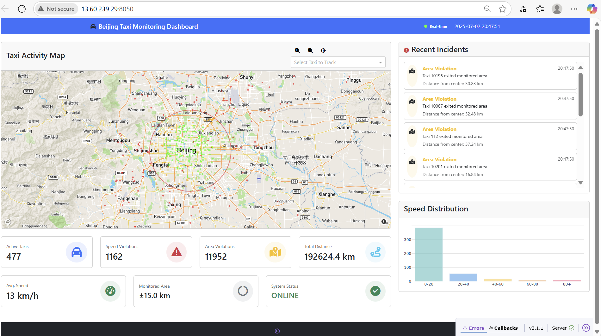

# Taxi Data Streaming Platform

## Description
A plug-and-play, containerized data pipeline for real-time taxi data streaming, analytics, and dashboarding.  

This project leverages Kafka, Flink, Redis, and a Dash web app, all orchestrated with Docker Compose. It enables ingestion, processing, storage, and visualization of taxi location data in real time.

**Features:**
- Real-time data ingestion with a Python Kafka producer
- Stream processing and analytics with Apache Flink
- Fast in-memory storage with Redis
- Interactive dashboard with Dash
- Easy local development and deployment using Docker Compose

## Visuals

*Example: Real-time taxi activity dashboard.*

## Installation

### Requirements
- [Docker](https://www.docker.com/get-started)
- [Docker Compose](https://docs.docker.com/compose/install/)


### Steps

1. **Clone the repository:**
   ```sh
   git clone https://collaborating.tuhh.de/e-19/teaching/bd25_project_a6_b.git
   cd bd25_project_a6_b
   ```

2. **Build and start all services:**
   ```sh
   docker-compose up -d --build
   ```

3. **Check services:**
   ```sh
   docker ps
   ```

4. **Access the dashboard:**  
   Open [http://localhost:8050](http://localhost:8050) in your browser.

## Usage

- **View Kafka topics:**
  ```sh
  docker exec -it kafka kafka-topics --bootstrap-server kafka:29092 --list
  ```
- **Consume messages from a topic:**
  ```sh
  docker exec -it kafka kafka-console-consumer --bootstrap-server kafka:29092 --topic taxi-locations --from-beginning --max-messages 5
  ```
- **Access Flink dashboard:**  
  [http://localhost:8081](http://localhost:8081)
- **Inspect Redis data:**
  ```sh
  docker exec -it redis redis-cli
  ```


## Support
Open an issue in the repository
Email any of the contributors

## Roadmap
- Add more analytics to the dashboard
- Integrate authentication for dashboard access

## Contributing
Contributions are welcome!
Please fork the repository and submit a pull request.
For major changes, open an issue first to discuss what you would like to change.

Development commands and tips are in [dev_commands.md](dev_commands.md).


## Authors and acknowledgment
Contributors: [Matthew Ayodele, Parthav, Sanika, Sunmeet]
Supervisors: [Prof. Stefan Schulte, Nisal]
Thanks to the open source community for Kafka, Flink, Redis, and Dash.


## License
This project is licensed under the MIT License.

## Project status
Actively maintained.
If you are interested in helping maintain or extend the project, please open an issue or contact the author.